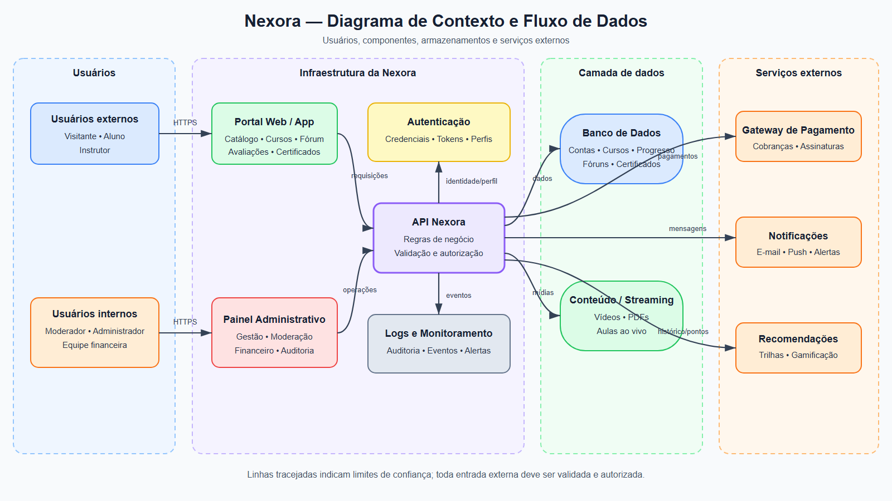

# Engenharia de Software Seguro — Projeto Nexora

## 1.1 Identificação do Sistema

* **Nome do Sistema:** Nexora (Plataforma de Ensino e Aprendizagem Online)
* **Empresa/Cliente:** Nexora Educação Digital LTDA.
* **Integrantes do Grupo:**
  * **Bruna Rosa Ferreira** — brunarf.aluno@unipampa.edu.br — [GitHub](https://github.com/eumuno)
  * **Erik Bruckmann Soares** — eriksoares.aluno@unipampa.edu.br — [GitHub](https://github.com/Erikbruckmann1)
  * **Gabriela Muniz Barreto** — gabrielamuniz.aluno@unipampa.edu.br — [GitHub](https://github.com/gabrielamnzb)
  * **Inaurrara Flores Rozado** — inaurrararozado.aluno@unipampa.edu.br — [GitHub](https://github.com/Inaurrara/)
* **Endereço do Repositório:** `https://github.com/eumuno/ess-nexora`
* **Justificativa da Escolha:** 
  A escolha da plataforma Nexora fundamenta-se na relevância de sistemas de e-learning no cenário educacional atual e no alto volume de dados sensíveis transacionados. A aplicação lida com múltiplos perfis de acesso, processamento de pagamentos, proteção de propriedade intelectual (vídeos e materiais educativos) e dados pessoais protegidos por legislações como a LGPD. Além disso, incidentes recentes no mercado envolvendo vazamentos de dados em plataformas EAD evidenciam a necessidade de incorporar a segurança desde a fase de concepção e modelagem de requisitos.
  
---

## 1.2 Descrição do Sistema

### Visão Geral e Problema Resolvido
A Nexora é uma startup voltada para a educação digital que conecta alunos e instrutores independentes em um ambiente web e mobile. O sistema resolve o problema de distribuição, comercialização e consumo de cursos profissionalizantes e de tecnologia, permitindo a gestão completa do aprendizado em uma única plataforma.

### Público-Alvo e Perfis de Usuários
* **Visitantes:** Usuários não autenticados que navegam pelo catálogo e visualizam prévias dos cursos.
* **Alunos:** Usuários que adquirem cursos, assistem videoaulas, realizam avaliações, participam de fóruns e baixam certificados.
* **Instrutores:** Profissionais que criam, publicam e gerenciam conteúdos de cursos, além de acompanhar o desempenho dos alunos.
* **Administradores / Moderadores:** Atores internos responsáveis pela gestão de usuários, moderação de conteúdos, auditoria de logs e suporte financeiro.

### Principais Funcionalidades
1. Cadastro, autenticação e recuperação de credenciais de acesso.
2. Catálogo de cursos com busca, filtros e recomendações personalizadas.
3. Processamento de pagamentos para compra de cursos e assinaturas.
4. Player de vídeo para transmissão de aulas ao vivo e gravadas.
5. Emissão e validação de certificados digitais de conclusão.
6. Fórum de dúvidas e interação entre alunos e instrutores.
7. Painel administrativo para gestão do sistema e visualização de relatórios.

### Informações Armazenadas e Recursos a Serem Protegidos
* **Dados Pessoais e Credenciais:** Nome, CPF, e-mail, senhas (hashes) e dados de perfil de alunos e instrutores.
* **Informações Financeiras:** Histórico de transações, dados de cobrança e integração com gateways de pagamento.
* **Propriedade Intelectual:** Arquivos de vídeo, PDFs, avaliações e código-fonte dos cursos.
* **Ativos Críticos de Infraestrutura:** Banco de dados relacional, servidores de streaming de vídeo, APIs de integração e logs de auditoria.

---

## 1.3 Usuários, Ativos e Pontos de Interação

### 1.3.1 Usuários e perfis de acesso

| Usuário ou perfil | Principais ações | Nível de acesso |
| --- | --- | --- |
| Visitante | Consultar o catálogo, pesquisar cursos e visualizar conteúdos de demonstração | Público, sem autenticação |
| Aluno | Comprar e acessar cursos, assistir a aulas, baixar materiais, realizar avaliações, participar de fóruns, acompanhar trilhas e emitir certificados | Autenticado, restrito aos próprios dados e aos cursos adquiridos |
| Instrutor | Criar e atualizar cursos, enviar vídeos e materiais, elaborar avaliações, corrigir atividades, interagir nos fóruns e consultar o desempenho dos alunos | Autenticado, restrito aos cursos sob sua responsabilidade |
| Moderador | Analisar denúncias, moderar fóruns e conteúdos e aplicar medidas previstas pelas políticas da plataforma | Acesso interno privilegiado e limitado às funções de moderação |
| Administrador | Gerenciar contas, perfis e permissões, remover conteúdos, consultar logs e configurar recursos da plataforma | Acesso interno privilegiado a funções administrativas |
| Equipe financeira | Consultar transações, assinaturas, repasses, estornos e relatórios financeiros | Acesso interno restrito às operações financeiras |

Todos os perfis autenticados utilizam credenciais individuais. As permissões devem seguir o princípio do menor privilégio, especialmente para moderadores, administradores e membros da equipe financeira.

### 1.3.2 Ativos importantes

Ativos são dados ou recursos cujo acesso, alteração, destruição ou indisponibilidade indevidos podem causar prejuízo à Nexora e aos seus usuários.

| Ativo | Exemplos | Requisito de segurança predominante | Possível prejuízo em caso de comprometimento |
| --- | --- | --- | --- |
| Credenciais e sessões | Hashes de senhas, tokens de acesso, códigos de recuperação e sessões autenticadas | Confidencialidade e integridade | Invasão de contas e execução de ações em nome da vítima |
| Dados pessoais | Nome, CPF, e-mail, dados de perfil e informações de instrutores | Confidencialidade e integridade | Violação de privacidade, fraude e descumprimento da LGPD |
| Dados financeiros | Histórico de compras, assinaturas, cobranças, repasses e identificadores de transação | Confidencialidade e integridade | Fraude, prejuízo financeiro e contestação de pagamentos |
| Conteúdo educacional | Videoaulas, transmissões ao vivo, PDFs, avaliações e materiais complementares | Confidencialidade, integridade e disponibilidade | Pirataria, alteração ou perda de propriedade intelectual |
| Registros acadêmicos | Matrículas, progresso, notas, respostas de avaliações, trilhas e certificados | Integridade e disponibilidade | Certificados inválidos, perda do progresso e resultados incorretos |
| Fóruns e avaliações | Mensagens, denúncias, comentários e avaliações dos cursos | Integridade e disponibilidade | Assédio, desinformação, fraude de reputação e perda de confiança |
| Perfis e permissões | Papéis de aluno, instrutor, moderador, administrador e financeiro | Integridade | Elevação indevida de privilégios e acesso a funções restritas |
| Logs de auditoria | Registros de login, operações administrativas, pagamentos e alterações relevantes | Integridade e disponibilidade | Perda de rastreabilidade e dificuldade de investigar incidentes |
| Disponibilidade da plataforma | Portal, aplicativo, API, autenticação, streaming e aulas ao vivo | Disponibilidade | Interrupção das aulas, perda de vendas e dano à reputação |
| Algoritmos e dados de recomendação | Preferências, histórico de consumo, trilhas e resultados de gamificação | Confidencialidade e integridade | Recomendações manipuladas, exposição de hábitos e perda de confiança |

Os ativos mais críticos são as credenciais e sessões, os dados pessoais e financeiros, as permissões administrativas, os registros acadêmicos, os conteúdos dos cursos e os logs de auditoria.

### 1.3.3 Pontos de interação e componentes

| Elemento | Função e dados envolvidos |
| --- | --- |
| Portal web e aplicativo móvel | Interfaces utilizadas para cadastro, autenticação, compra, consumo e administração de cursos |
| Serviço de autenticação e autorização | Valida credenciais, emite sessões ou tokens e verifica as permissões de cada perfil |
| API da Nexora | Recebe as requisições das interfaces e aplica as regras de negócio e de autorização |
| Banco de dados | Armazena contas, perfis, cursos, matrículas, progresso, avaliações, fóruns, certificados e referências de transações |
| Armazenamento de conteúdo e serviço de streaming | Guarda e entrega vídeos, aulas ao vivo, imagens, PDFs e outros materiais educacionais |
| Gateway de pagamento | Processa compras, assinaturas, estornos e confirmações financeiras; a Nexora deve evitar armazenar dados completos de cartão |
| Serviço de notificações | Envia mensagens de confirmação, recuperação de conta, avisos de aula e alertas de segurança por e-mail ou push |
| Mecanismo de recomendações e gamificação | Processa preferências, histórico de aprendizagem, pontuações, conquistas e sugestões de cursos |
| Painel administrativo | Permite moderação, suporte, gestão de contas e permissões, consulta de logs e acompanhamento financeiro |
| Sistema de logs e monitoramento | Registra eventos relevantes, detecta comportamentos suspeitos e apoia auditorias e resposta a incidentes |

Os principais pontos de entrada sujeitos a abuso são as telas e APIs de autenticação e recuperação de senha, upload e download de arquivos, fóruns, avaliações, pagamentos, emissão e validação de certificados e funções administrativas.

---

## 1.4 Visão Geral da Arquitetura ou Fluxo

A Nexora utiliza interfaces web e mobile para conectar visitantes, alunos, instrutores e usuários internos aos serviços da plataforma. As requisições autenticadas passam pela API, que consulta o serviço de autenticação e autorização antes de acessar dados ou executar operações. Vídeos e materiais são armazenados separadamente do banco de dados, enquanto pagamentos e notificações dependem de serviços externos.

Arquivo-fonte editável: [diagrama-contexto-nexora.drawio](diagramas/diagrama-contexto-nexora.drawio).

### 1.4.1 Fluxos principais de dados

| ID | Origem e destino | Dados ou operação | Proteção necessária |
| --- | --- | --- | --- |
| F01 | Usuários → Portal/App → Autenticação | Credenciais, recuperação de conta e tokens de sessão | TLS, hash seguro de senhas, limitação de tentativas e autenticação reforçada para acessos privilegiados |
| F02 | Portal/App → API → Banco de dados | Perfis, cursos, matrículas, progresso, avaliações, fóruns e certificados | Autorização no servidor, validação de entrada, criptografia e registro de operações relevantes |
| F03 | Instrutor → API → Armazenamento/Streaming | Upload de vídeos, PDFs, imagens e aulas ao vivo | Validação de tipo e tamanho, análise de arquivos, autorização e proteção contra acesso não contratado |
| F04 | Aluno → API → Gateway de pagamento | Pedido, valor, assinatura e identificador da transação | TLS, validação do valor no servidor, tokenização e verificação da resposta do gateway |
| F05 | API → Serviço de notificações → Usuário | Confirmações, avisos, recuperação de conta e alertas | Evitar dados sensíveis desnecessários, autenticar a integração e proteger links e códigos temporários |
| F06 | API → Recomendações/Gamificação → Banco de dados | Histórico de aprendizagem, preferências, pontos e conquistas | Minimização de dados, controle de acesso e prevenção de manipulação de pontuações |
| F07 | Painel administrativo → API → Logs/Banco de dados | Gestão de usuários e permissões, moderação, suporte e auditoria | Menor privilégio, autenticação forte, trilha de auditoria e revisão de acessos |

### 1.4.2 Limites de confiança

O primeiro limite de confiança está entre os dispositivos dos usuários e a infraestrutura da Nexora, pois todo dado recebido do navegador ou aplicativo deve ser tratado como não confiável. O segundo está entre a API e os serviços externos de pagamento e notificações, cujas respostas precisam ser autenticadas e validadas. O terceiro separa as funções comuns das funções privilegiadas do painel administrativo. O quarto protege a camada de dados, na qual somente serviços autorizados devem acessar o banco, o armazenamento de conteúdo e os logs.

---

## 1.5 Modelagem de Ameaças com STRIDE
A modelagem a seguir aplica o método STRIDE aos componentes, ativos e fluxos
identificados nas Seções 1.3 e 1.4. A análise adota a perspectiva de um agente
malicioso externo ou interno sobre os pontos de entrada mais expostos da
Nexora: autenticação e recuperação de senha, upload e consumo de conteúdo,
avaliações, emissão de certificados, pagamentos e funções administrativas. A
coluna *Fluxo* referencia os fluxos de dados descritos na Seção 1.4.1.

| ID | Categoria STRIDE | Componente ou ativo | Fluxo | Ameaça identificada | Possível impacto |
| --- | --- | --- | --- | --- | --- |
| T01 | Spoofing | Serviço de autenticação e autorização / Credenciais e sessões | F01 | Atacante reutiliza pares de e-mail e senha vazados de outros serviços para acessar contas da Nexora | Invasão de contas, acesso a dados pessoais e uso indevido de cursos adquiridos |
| T02 | Spoofing | Portal web e aplicativo móvel / Perfis e permissões | F01 | Pessoa mal-intencionada cadastra-se como instrutor usando o nome de um profissional ou marca conhecida, sem verificação de identidade | Alunos enganados, prejuízo financeiro e dano à reputação da plataforma |
| T03 | Spoofing | Serviço de notificações | F05 | Mensagens de recuperação de conta são imitadas por terceiros, pois o remetente não é autenticado nem os links protegidos | Captura de credenciais por phishing e comprometimento de contas legítimas |
| T04 | Spoofing | Gateway de pagamento / API da Nexora | F04 | Requisição forjada ao endpoint de retorno do gateway simula a confirmação de um pagamento que não ocorreu | Liberação de cursos e assinaturas sem receita correspondente |
| T05 | Tampering | API da Nexora / Gateway de pagamento | F04 | Aluno altera no cliente o identificador do curso, o valor ou os parâmetros de uma compra, e a API processa a solicitação sem recalcular e validar os dados no servidor | Compra por valor inferior, liberação indevida de conteúdo e divergências financeiras |
| T06 | Repudiation | Logs e monitoramento / Operações administrativas e financeiras | F07 | Usuário privilegiado realiza estorno, alteração de permissão ou remoção de conteúdo e posteriormente nega a ação porque os logs são incompletos ou podem ser alterados | Perda de rastreabilidade, dificuldade de responsabilização e contestação de operações |
| T07 | Information Disclosure | API da Nexora / Banco de dados | F02 | Usuário autenticado altera um identificador em uma requisição e acessa perfil, progresso, avaliação, certificado ou transação pertencente a outra pessoa | Exposição de dados pessoais, acadêmicos e financeiros e possível violação da LGPD |
| T08 | Denial of Service | Portal, API e serviço de streaming | F02 / F03 | Atacante envia grande volume de requisições, consultas ou acessos simultâneos a vídeos e aulas ao vivo, consumindo os recursos disponíveis | Indisponibilidade de aulas, avaliações e vendas, além de perda de receita e reputação |
| T09 | Elevation of Privilege | API da Nexora / Perfis e permissões / Painel administrativo | F07 | Aluno ou instrutor chama diretamente uma função administrativa sem que a API valide o papel e a permissão exigidos | Acesso administrativo, alteração de contas e permissões, remoção de conteúdo e comprometimento amplo da plataforma |

Todas as categorias do STRIDE são aplicáveis à Nexora. As ameaças foram formuladas como situações concretas e vinculadas aos fluxos, componentes e ativos descritos anteriormente.

---

## 1.6 Casos de Abuso (Abuse Cases)

### CA01 — Comprometimento de conta por phishing ou reutilização de senha

**Ator:** atacante externo.

**Objetivo:** assumir a conta de um aluno, instrutor ou administrador para acessar dados e executar ações em seu nome.

**Condições necessárias:** reutilização de credenciais, sucesso de uma mensagem de phishing ou ausência de autenticação adicional para acessos e operações sensíveis.

**Fluxo de abuso:**

1. O atacante obtém ou captura o e-mail e a senha da vítima.
2. Realiza tentativas de autenticação no portal ou aplicativo da Nexora.
3. O sistema aceita as credenciais sem uma verificação adicional.
4. O atacante acessa dados, cursos e funcionalidades disponíveis para a vítima.

**Impacto esperado:** invasão de conta, exposição de dados pessoais, uso indevido de cursos, alterações não autorizadas e perda de confiança.

**Categorias STRIDE relacionadas:** Spoofing e Information Disclosure.

**Ameaças relacionadas:** T01 e T03.

### CA02 — Cadastro de instrutor falso

**Ator:** pessoa mal-intencionada.

**Objetivo:** obter confiança e pagamentos utilizando indevidamente a identidade de um profissional ou marca.

**Condições necessárias:** cadastro de instrutor sem verificação suficiente de identidade e ausência de revisão antes da publicação de cursos.

**Fluxo de abuso:**

1. O agente cria uma conta de instrutor com dados de terceiro.
2. Publica um curso ou material usando uma identidade reconhecida.
3. Alunos confiam no perfil e realizam compras.
4. O agente recebe valores ou coleta informações antes da detecção da fraude.

**Impacto esperado:** fraude, prejuízo aos alunos, estornos e danos à reputação da Nexora e da pessoa imitada.

**Categorias STRIDE relacionadas:** Spoofing.

**Ameaças relacionadas:** T02.

### CA03 — Liberação de curso sem pagamento válido

**Ator:** aluno mal-intencionado ou atacante externo.

**Objetivo:** obter acesso a cursos ou assinaturas sem pagar o valor correto.

**Condições necessárias:** parâmetros financeiros aceitos do cliente ou retorno do gateway sem validação de autenticidade, integridade e correspondência com o pedido original.

**Fluxo de abuso:**

1. O agente inicia uma compra legítima.
2. Altera o valor, o curso ou o identificador da transação, ou envia uma confirmação forjada.
3. A API aceita os dados sem recalcular o pedido ou validar a resposta do gateway.
4. O sistema libera o conteúdo sem que o pagamento correto tenha ocorrido.

**Impacto esperado:** perda de receita, divergências financeiras, acesso indevido a conteúdo e aumento de contestações.

**Categorias STRIDE relacionadas:** Spoofing e Tampering.

**Ameaças relacionadas:** T04 e T05.

### CA04 — Negação de operação privilegiada

**Ator:** administrador, moderador ou integrante da equipe financeira.

**Objetivo:** executar uma ação indevida e dificultar sua atribuição posterior.

**Condições necessárias:** logs incompletos, sem proteção de integridade ou sem identificação suficiente do usuário, horário, origem e resultado da operação.

**Fluxo de abuso:**

1. O usuário privilegiado altera uma permissão, remove conteúdo ou realiza um estorno.
2. O sistema executa a operação sem gerar uma trilha de auditoria confiável.
3. O usuário nega ter realizado a ação.
4. A equipe não consegue reconstruir o evento nem atribuir responsabilidade com segurança.

**Impacto esperado:** perda de rastreabilidade, fraude interna, dificuldade de investigação e responsabilização.

**Categorias STRIDE relacionadas:** Repudiation.

**Ameaças relacionadas:** T06.

### CA05 — Consulta de dados de outro usuário

**Ator:** usuário autenticado mal-intencionado.

**Objetivo:** acessar dados pessoais, acadêmicos ou financeiros de outra pessoa.

**Condições necessárias:** API baseada apenas em identificadores fornecidos pelo cliente e ausência de verificação de propriedade ou permissão sobre o recurso solicitado.

**Fluxo de abuso:**

1. O agente acessa um recurso pertencente à própria conta.
2. Altera o identificador presente na URL ou na requisição.
3. A API consulta o banco sem verificar se o recurso pertence ao solicitante.
4. Dados de outra pessoa são retornados.

**Impacto esperado:** violação de privacidade e da LGPD, fraude, exposição de hábitos de aprendizagem e danos à reputação.

**Categorias STRIDE relacionadas:** Information Disclosure.

**Ameaças relacionadas:** T07.

### CA06 — Sobrecarga da plataforma e das aulas ao vivo

**Ator:** atacante externo ou grupo de atacantes.

**Objetivo:** impedir o acesso de usuários legítimos à plataforma.

**Condições necessárias:** ausência de limitação de requisições, proteção contra tráfego abusivo ou capacidade suficiente para picos de acesso.

**Fluxo de abuso:**

1. O atacante identifica endpoints ou conteúdos que consomem mais recursos.
2. Envia grande volume de requisições ao portal, API ou streaming.
3. Os recursos disponíveis são esgotados ou degradados.
4. Alunos e instrutores não conseguem acessar aulas, avaliações e conteúdos.

**Impacto esperado:** indisponibilidade, perda de aulas e vendas, aumento de suporte e dano à reputação.

**Categorias STRIDE relacionadas:** Denial of Service.

**Ameaças relacionadas:** T08.

### CA07 — Acesso indevido ao painel administrativo

**Ator:** aluno ou instrutor mal-intencionado.

**Objetivo:** obter funções administrativas e controlar recursos da plataforma.

**Condições necessárias:** autorização verificada apenas na interface ou validação insuficiente do papel do usuário na API.

**Fluxo de abuso:**

1. O agente autentica-se com uma conta comum.
2. Descobre ou reproduz uma requisição utilizada pelo painel administrativo.
3. Envia a requisição diretamente à API.
4. A API executa a função sem validar a permissão necessária.

**Impacto esperado:** alteração de contas e permissões, remoção de conteúdo, acesso a dados e comprometimento amplo da Nexora.

**Categorias STRIDE relacionadas:** Elevation of Privilege.

**Ameaças relacionadas:** T09.

---

## 1.7 Considerações Finais

As ameaças mais preocupantes são o comprometimento de contas, a exposição de dados por falhas de autorização, a manipulação ou falsificação de pagamentos, a indisponibilidade da plataforma e a obtenção de privilégios administrativos. Elas atingem ativos críticos como credenciais, dados pessoais e financeiros, registros acadêmicos, conteúdos dos cursos, permissões e logs de auditoria.

Os casos de abuso com maior impacto são o acesso indevido ao painel administrativo, a consulta de dados de outros usuários, a liberação de cursos sem pagamento válido e a sobrecarga da plataforma. A principal dificuldade da análise foi avaliar um sistema ainda não implementado; por isso, as condições descritas representam hipóteses de projeto que deverão ser confirmadas ou revisadas nas etapas seguintes.

---

# Etapa 2 — Análise, Priorização e Tratamento de Riscos com o NIST CSF 2.0

## 2.1 Objetivo e continuidade

Esta etapa transforma as ameaças e os casos de abuso da Etapa 1 em riscos avaliáveis e comparáveis. A avaliação é inicial e considera as características conhecidas da Nexora e as condições hipotéticas identificadas durante a modelagem. Os valores deverão ser revistos caso a arquitetura, os controles existentes ou evidências de implementação alterem o contexto.

## 2.2 Critérios de probabilidade

| Valor | Classificação | Critério utilizado |
| ---: | --- | --- |
| 1 | Baixa | O evento depende de condições incomuns, acesso muito específico ou grande capacidade técnica |
| 2 | Média-baixa | O evento é possível, mas depende de uma vulnerabilidade ou condição específica |
| 3 | Média-alta | O evento é plausível e pode ocorrer em situações comuns de uso ou ataque |
| 4 | Alta | O evento pode ocorrer com facilidade, frequência ou em condições previsíveis |

## 2.3 Critérios de impacto

| Valor | Classificação | Critério utilizado |
| ---: | --- | --- |
| 1 | Baixo | Causa pequeno transtorno e pode ser corrigido rapidamente |
| 2 | Moderado | Causa interrupção ou inconsistência limitada, com possibilidade de recuperação |
| 3 | Alto | Causa prejuízo relevante aos usuários, ao negócio ou à privacidade |
| 4 | Muito alto | Pode afetar muitos usuários, comprometer operações críticas ou causar prejuízo grave |

## 2.4 Registro inicial dos riscos

A pontuação é calculada por `Probabilidade × Impacto`. Pontuações de 1 a 3 representam risco baixo; de 4 a 7, médio; de 8 a 11, alto; e de 12 a 16, crítico.

| ID | Origem STRIDE | Caso de abuso | Evento de risco | Vulnerabilidade ou condição | Probabilidade | Impacto | Pontuação | Nível |
| --- | --- | --- | --- | --- | ---: | ---: | ---: | --- |
| R01 | T01 — Spoofing | CA01 | Atacante acessa uma conta utilizando credenciais reutilizadas ou vazadas | Reutilização de senhas e ausência de autenticação adicional | 3 | 4 | 12 | Crítico |
| R02 | T02 — Spoofing | CA02 | Pessoa mal-intencionada publica cursos utilizando identidade falsa de instrutor | Ausência de verificação de identidade e revisão do perfil | 3 | 3 | 9 | Alto |
| R03 | T03 — Spoofing | CA01 | Usuário entrega suas credenciais a uma página falsa de recuperação de conta | Remetente não autenticado, links pouco protegidos e baixa distinção das mensagens oficiais | 4 | 3 | 12 | Crítico |
| R04 | T04 — Spoofing | CA03 | Curso é liberado após uma confirmação de pagamento forjada | Retorno do gateway sem autenticação e validação de correspondência com o pedido | 2 | 4 | 8 | Alto |
| R05 | T05 — Tampering | CA03 | Compra é processada com valor ou curso alterado pelo cliente | Confiança em parâmetros financeiros enviados pelo cliente | 3 | 4 | 12 | Crítico |
| R06 | T06 — Repudiation | CA04 | Operação administrativa ou financeira é negada e não pode ser atribuída com segurança | Logs incompletos ou sem proteção de integridade | 2 | 3 | 6 | Médio |
| R07 | T07 — Information Disclosure | CA05 | Usuário acessa dados pertencentes a outra pessoa por alteração de identificador | Falta de autorização em nível de objeto na API | 3 | 4 | 12 | Crítico |
| R08 | T08 — Denial of Service | CA06 | Portal, API ou streaming fica indisponível por sobrecarga intencional | Ausência de limitação, proteção contra tráfego abusivo ou capacidade adequada | 3 | 4 | 12 | Crítico |
| R09 | T09 — Elevation of Privilege | CA07 | Conta comum executa funções administrativas diretamente pela API | Autorização apenas na interface ou validação insuficiente de papéis no servidor | 2 | 4 | 8 | Alto |

## 2.5 Justificativas das avaliações

### R01 — Uso indevido de conta com credenciais comprometidas

**Origem e caso relacionado:** T01 — Spoofing; CA01.

**Justificativa da probabilidade:** a probabilidade foi classificada como 3 — média-alta — porque a reutilização de senhas e o vazamento de credenciais são situações plausíveis em serviços acessados pela internet. O ataque pode ser automatizado contra o login da Nexora, embora ainda dependa de o usuário reutilizar uma credencial válida e de não existir verificação adicional.

**Justificativa do impacto:** o impacto foi classificado como 4 — muito alto — porque a conta comprometida pode permitir acesso a dados pessoais, registros acadêmicos e cursos adquiridos. Se a vítima for instrutor ou administrador, o alcance inclui conteúdo, informações de alunos e funções privilegiadas.

**Usuários e elementos afetados:** alunos, instrutores, administradores e equipe financeira; credenciais, sessões, perfis, dados pessoais, cursos, API e serviço de autenticação.

**Consequências e classificação:** invasão de conta, exposição de dados, ações fraudulentas e dano à reputação. Probabilidade 3 × impacto 4 = 12 — risco crítico, adequado à combinação de ocorrência plausível com possível comprometimento de operações e dados relevantes.

### R02 — Cadastro e atuação de instrutor falso

**Origem e caso relacionado:** T02 — Spoofing; CA02.

**Justificativa da probabilidade:** a probabilidade foi classificada como 3 — média-alta — porque o cadastro é uma funcionalidade comum e pode ser explorado sem capacidade técnica elevada se não houver validação de identidade. O agente ainda precisa produzir um perfil convincente e conseguir publicar conteúdo, o que impede a classificação máxima.

**Justificativa do impacto:** o impacto foi classificado como 3 — alto — porque alunos podem ser enganados e realizar pagamentos, enquanto a identidade de terceiros e a reputação da Nexora são afetadas. O alcance tende a ficar inicialmente limitado aos alunos expostos ao perfil fraudulento.

**Usuários e elementos afetados:** alunos, instrutores legítimos, suporte e equipe financeira; perfis, catálogo, cursos, pagamentos e reputação da plataforma.

**Consequências e classificação:** fraude, estornos, denúncias, remoção de conteúdo e perda de confiança. Probabilidade 3 × impacto 3 = 9 — risco alto.

### R03 — Captura de credenciais por falsa recuperação de conta

**Origem e caso relacionado:** T03 — Spoofing; CA01.

**Justificativa da probabilidade:** a probabilidade foi classificada como 4 — alta — porque mensagens de phishing podem ser distribuídas em grande escala, com baixo custo e sem acesso prévio à infraestrutura da Nexora. Usuários que esperam avisos de curso ou recuperação de senha podem ser abordados em condições previsíveis.

**Justificativa do impacto:** o impacto foi classificado como 3 — alto — porque o sucesso expõe credenciais e pode resultar em comprometimento de contas. Embora possa afetar muitas pessoas, cada vítima ainda precisa interagir com a mensagem, e os danos podem variar conforme o perfil comprometido.

**Usuários e elementos afetados:** principalmente alunos e instrutores, podendo incluir usuários internos; credenciais, sessões, serviço de notificações e serviço de autenticação.

**Consequências e classificação:** roubo de credenciais, invasão de contas, exposição de dados e fraude. Probabilidade 4 × impacto 3 = 12 — risco crítico, devido à facilidade e escala potencial do ataque.

### R04 — Confirmação forjada de pagamento

**Origem e caso relacionado:** T04 — Spoofing; CA03.

**Justificativa da probabilidade:** a probabilidade foi classificada como 2 — média-baixa — porque o ataque depende do conhecimento do endpoint de retorno e de uma falha específica na autenticação ou validação da integração com o gateway.

**Justificativa do impacto:** o impacto foi classificado como 4 — muito alto — porque a exploração repetida pode liberar cursos e assinaturas sem receita, comprometer a conciliação financeira e afetar repasses a instrutores.

**Usuários e elementos afetados:** Nexora, instrutores, alunos legítimos e equipe financeira; API, gateway, pedidos, transações, assinaturas e conteúdo educacional.

**Consequências e classificação:** perda financeira, divergências contábeis, acesso indevido e contestações. Probabilidade 2 × impacto 4 = 8 — risco alto.

### R05 — Manipulação de valor ou produto na compra

**Origem e caso relacionado:** T05 — Tampering; CA03.

**Justificativa da probabilidade:** a probabilidade foi classificada como 3 — média-alta — porque parâmetros enviados pelo navegador ou aplicativo podem ser inspecionados e alterados com ferramentas amplamente disponíveis. A exploração é plausível se a API confiar no valor ou no identificador recebido do cliente.

**Justificativa do impacto:** o impacto foi classificado como 4 — muito alto — porque a falha pode ser repetida em várias compras, causando perda de receita, repasses incorretos e liberação de propriedade intelectual sem pagamento adequado.

**Usuários e elementos afetados:** Nexora, instrutores, equipe financeira e compradores legítimos; API, gateway, catálogo, pedidos, transações e cursos.

**Consequências e classificação:** fraude financeira, inconsistência de registros e perda de receita. Probabilidade 3 × impacto 4 = 12 — risco crítico.

### R06 — Negação de operação privilegiada

**Origem e caso relacionado:** T06 — Repudiation; CA04.

**Justificativa da probabilidade:** a probabilidade foi classificada como 2 — média-baixa — porque depende simultaneamente de um usuário com acesso privilegiado e de registros insuficientes ou alteráveis.

**Justificativa do impacto:** o impacto foi classificado como 3 — alto — porque a ausência de evidências dificulta investigações, estornos, moderação e responsabilização, embora normalmente não cause por si só o comprometimento imediato de toda a plataforma.

**Usuários e elementos afetados:** administradores, moderadores, equipe financeira, instrutores e usuários atingidos pela operação; painel administrativo, logs, permissões, conteúdo e transações.

**Consequências e classificação:** perda de rastreabilidade, fraude interna, disputas e resposta inadequada a incidentes. Probabilidade 2 × impacto 3 = 6 — risco médio.

### R07 — Exposição de dados por falha de autorização em objeto

**Origem e caso relacionado:** T07 — Information Disclosure; CA05.

**Justificativa da probabilidade:** a probabilidade foi classificada como 3 — média-alta — porque usuários autenticados manipulam identificadores durante o uso normal da API, e a enumeração pode ser realizada com ferramentas simples caso a autorização não seja verificada para cada recurso.

**Justificativa do impacto:** o impacto foi classificado como 4 — muito alto — porque podem ser expostos dados pessoais, progresso, avaliações, certificados e referências financeiras de muitos usuários, gerando consequências regulatórias relacionadas à LGPD.

**Usuários e elementos afetados:** alunos, instrutores e usuários internos; API, banco de dados, perfis, registros acadêmicos, certificados e transações.

**Consequências e classificação:** violação de privacidade, fraude, sanções, comunicação de incidente e dano à reputação. Probabilidade 3 × impacto 4 = 12 — risco crítico.

### R08 — Indisponibilidade do portal, API ou streaming

**Origem e caso relacionado:** T08 — Denial of Service; CA06.

**Justificativa da probabilidade:** a probabilidade foi classificada como 3 — média-alta — porque a plataforma e o streaming são acessíveis pela internet e enfrentam picos previsíveis em aulas ao vivo e lançamentos. A sobrecarga maliciosa é plausível, embora sua eficácia dependa da capacidade e das proteções adotadas.

**Justificativa do impacto:** o impacto foi classificado como 4 — muito alto — porque uma interrupção pode afetar simultaneamente muitos alunos e instrutores, impedir aulas e avaliações e interromper vendas.

**Usuários e elementos afetados:** visitantes, alunos, instrutores, suporte e área financeira; portal, aplicativo, API, autenticação, streaming e infraestrutura.

**Consequências e classificação:** perda de aulas e receita, descumprimento de compromissos, aumento de suporte e dano à reputação. Probabilidade 3 × impacto 4 = 12 — risco crítico.

### R09 — Execução indevida de funções administrativas

**Origem e caso relacionado:** T09 — Elevation of Privilege; CA07.

**Justificativa da probabilidade:** a probabilidade foi classificada como 2 — média-baixa — porque o ataque depende de uma falha específica de autorização no servidor e do conhecimento de endpoints privilegiados.

**Justificativa do impacto:** o impacto foi classificado como 4 — muito alto — porque privilégios administrativos permitem alterar contas, permissões, conteúdo e configurações, consultar logs e alcançar dados de muitos usuários.

**Usuários e elementos afetados:** todos os perfis; API, painel administrativo, perfis e permissões, banco de dados, conteúdo, logs e configurações.

**Consequências e classificação:** comprometimento amplo, fraude, remoção de conteúdo, exposição de dados e indisponibilidade. Probabilidade 2 × impacto 4 = 8 — risco alto.

## 2.6 Priorização dos riscos

| Prioridade | Risco | Pontuação | Nível | Justificativa da prioridade |
| ---: | --- | ---: | --- | --- |
| 1 | R07 — Exposição de dados por falha de autorização | 12 | Crítico | Pode atingir muitos usuários, envolve dados pessoais e financeiros e produz consequências regulatórias e reputacionais de difícil reversão |
| 2 | R01 — Uso indevido de conta | 12 | Crítico | Compromete identidade, dados e operações; contas privilegiadas ampliam o impacto para outros usuários e componentes |
| 3 | R05 — Manipulação de compra | 12 | Crítico | A exploração pode ser repetida e afeta diretamente receita, repasses e propriedade intelectual |
| 4 | R08 — Indisponibilidade da plataforma | 12 | Crítico | Pode interromper simultaneamente aulas, avaliações, consumo de conteúdo e vendas |
| 5 | R03 — Phishing de recuperação de conta | 12 | Crítico | Possui a maior probabilidade e grande alcance, mas depende da interação individual das vítimas para produzir dano |
| 6 | R09 — Execução de funções administrativas | 8 | Alto | Tem impacto sistêmico muito alto, porém depende de uma falha específica de autorização e de endpoints privilegiados |
| 7 | R04 — Confirmação forjada de pagamento | 8 | Alto | Pode causar perdas e divergências financeiras, mas exige uma falha específica na integração com o gateway |
| 8 | R02 — Instrutor falso | 9 | Alto | Apesar da pontuação superior a R09 e R04, tende a começar com alcance mais limitado e pode ser contido pela remoção do perfil e do conteúdo |
| 9 | R06 — Negação de operação privilegiada | 6 | Médio | Prejudica auditoria e responsabilização, mas possui menor probabilidade e impacto mais indireto que os demais riscos |

### Justificativa da ordem de prioridade

Os cinco riscos críticos receberam as primeiras posições. O R07 lidera porque combina alcance potencial sobre muitos titulares, exposição de ativos protegidos pela LGPD e dificuldade de reverter uma divulgação. O R01 vem em seguida porque o comprometimento de identidade funciona como porta de entrada para outros abusos e se torna sistêmico quando atinge um perfil privilegiado. O R05 ocupa a terceira posição pela possibilidade de fraude repetida e efeito direto sobre receita e repasses. O R08 ficou em quarto porque pode interromper toda a operação, mas seus efeitos tendem a cessar após a restauração do serviço. O R03, embora tenha probabilidade 4, ficou em quinto porque o dano depende da interação e do comprometimento individual de cada vítima.

Entre os riscos altos, R09 e R04 foram colocados antes de R02 mesmo com pontuação numérica menor. Essa decisão considera que o R09 pode comprometer toda a plataforma e que o R04 afeta a integridade da operação financeira, enquanto o R02 tende a ter alcance inicialmente restrito ao perfil falso e aos alunos que interagem com ele. O R06 ficou por último por apresentar nível médio e consequências predominantemente relacionadas à investigação e responsabilização.

A ordem é uma avaliação inicial. Ela deverá ser revisada quando o grupo definir os controles existentes, a arquitetura segura e as evidências das etapas de implementação e verificação.
