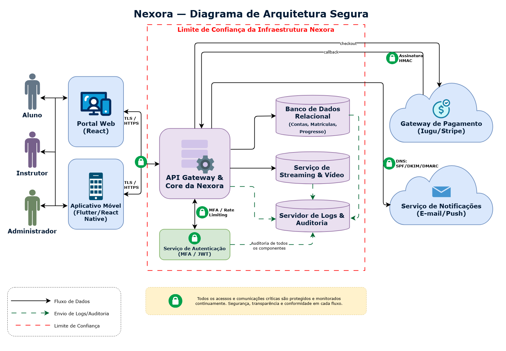

# 3 — Requisitos, Decisões de Arquitetura e Diagrama Seguro

Essa etapa tem como propósito transformar os riscos e controles identificados anteriormente em requisitos de segurança específicos e decisões de projeto. O objetivo principal é planejar a organização da plataforma Nexora para garantir a mitigação dos riscos prioritários de forma estruturada antes de avançar para a fase de codificação.

## 3.1 Requisitos de Segurança e Critérios de Verificação

| ID | Risco de Origem | Requisito de Segurança | Critério de Verificação |
| :--- | :--- | :--- | :--- |
| **RS01** | **R01 — Uso indevido de conta (Credential Stuffing)** | O sistema de autenticação na API da Nexora deve exigir autenticação multifator (MFA) obrigatória para contas com perfil de Instrutor e Administrador, e aplicar um mecanismo de limitação de taxa (Rate Limiting) bloqueando acessos após 5 tentativas de login consecutivas inválidas vindas do mesmo IP em menos de 15 minutos. | 1. Requisições de autenticação para perfis de Instrutor ou Administrador sem o envio do segundo fator (MFA) válido devem ser rejeitadas com status HTTP 401 Unauthorized. 2. A partir da 6ª tentativa consecutiva de login falha vinda do mesmo IP dentro de 15 minutos, o servidor de API deve recusar o processamento e retornar status HTTP 429 Too Many Requests. |
| **RS02** | **R03 — Ataques de phishing com e-mails falsos** | Todos os e-mails enviados em nome do domínio institucional @nexora.com devem ser autenticados na origem através da implementação e publicação correta das diretivas de segurança DNS: SPF (Sender Policy Framework), DKIM (DomainKeys Identified Mail) e uma política DMARC configurada estritamente com diretiva de rejeição (p=reject). | 1. Consultas públicas de registro DNS TXT para o domínio nexora.com devem retornar chaves públicas e diretivas SPF válidas autorizando os IPs dos servidores oficiais de envio. 2. A consulta DMARC deve retornar o parâmetro de política ativo em modo rígido como v=DMARC1; p=reject;, instruindo servidores de destino a rejeitarem e-mails não assinados. |
| **RS03** | **R04 — Forjamento de notificações de callback de pagamento** | O endpoint da API responsável pelo recebimento de notificações pós-venda enviadas pelo gateway de pagamento (/api/v1/payments/callback) deve verificar obrigatoriamente a assinatura criptográfica digital HMAC-SHA256 enviada nos cabeçalhos da requisição, calculando localmente o hash com base na chave secreta compartilhada antes de liberar qualquer curso. | 1. Requisições POST de callback recebidas sem a assinatura HMAC correspondente ou contendo um hash inválido devem ser rejeitadas imediatamente com erro HTTP 401 Unauthorized, sem que o curso associado seja liberado. 2. Tentativas de chamada ao endpoint sem verificação devem ser registradas nos logs do sistema como alertas de segurança de alta criticidade. |

## 3.2 Mapeamento de Vulnerabilidades

O mapeamento relaciona os requisitos já definidos a fraquezas catalogadas pela
CWE e a orientações oficiais da OWASP. As referências descrevem categorias de
fraqueza aplicáveis ao projeto; elas não afirmam que exista uma vulnerabilidade
implementada e comprovada, pois a Nexora ainda está em fase de especificação.

| Risco | Requisito | Vulnerabilidade ou categoria | Referência oficial | Relação com a Nexora |
| :--- | :--- | :--- | :--- | :--- |
| **R01** | **RS01** | **CWE-307 — Improper Restriction of Excessive Authentication Attempts** e **CWE-308 — Use of Single-factor Authentication** | [CWE-307](https://cwe.mitre.org/data/definitions/307.html), [CWE-308](https://cwe.mitre.org/data/definitions/308.html) e [OWASP Multifactor Authentication Cheat Sheet](https://cheatsheetseries.owasp.org/cheatsheets/Multifactor_Authentication_Cheat_Sheet.html) | Sem limitação de tentativas, o serviço de autenticação permite automatizar o teste de credenciais reutilizadas. Se contas privilegiadas dependerem apenas de senha, o comprometimento desse único fator é suficiente para autenticação completa. O MFA e o bloqueio mensurável do RS01 tratam diretamente essas duas condições. |
| **R03** | **RS02** | **CWE-290 — Authentication Bypass by Spoofing** | [CWE-290](https://cwe.mitre.org/data/definitions/290.html) | A ausência ou configuração inadequada de SPF, DKIM e DMARC dificulta que servidores destinatários diferenciem mensagens autorizadas das que falsificam a identidade do domínio. O RS02 estabelece autenticação da origem e política de rejeição para reduzir a aceitação de mensagens que se apresentem indevidamente como enviadas pela Nexora. |
| **R04** | **RS03** | **CWE-346 — Origin Validation Error** e **CWE-354 — Improper Validation of Integrity Check Value** | [CWE-346](https://cwe.mitre.org/data/definitions/346.html), [CWE-354](https://cwe.mitre.org/data/definitions/354.html) e [OWASP Third Party Payment Gateway Integration Cheat Sheet](https://cheatsheetseries.owasp.org/cheatsheets/Third_Party_Payment_Gateway_Integration_Cheat_Sheet.html) | Um callback aceito sem validar a origem e sem comparar corretamente a assinatura recebida com o HMAC calculado pode ser forjado ou alterado. O RS03 exige essa verificação antes da liberação do curso; a orientação da OWASP também recomenda autenticar callbacks, confirmar o pagamento no servidor e relacionar valor, moeda e pedido. |

### Rastreabilidade da seção

| Ameaça | Risco | Requisito | Vulnerabilidade ou categoria |
| :---: | :---: | :---: | :--- |
| T01 | R01 | RS01 | CWE-307 e CWE-308 |
| T03 | R03 | RS02 | CWE-290 |
| T04 | R04 | RS03 | CWE-346 e CWE-354 |

## 3.3 Diagrama de Arquitetura Segura

O diagrama de arquitetura segura a seguir ilustra a distribuição física e lógica dos componentes da plataforma Nexora, as fronteiras de isolamento de rede, os fluxos de dados sensíveis e o posicionamento exato das salvaguardas de segurança projetadas para mitigar os riscos de maior impacto do negócio.

*   **Arquivo-fonte editável:** [arquitetura-segura.drawio](../diagramas/etapa-3/arquitetura-segura.drawio)

---

#### 3.3.1 Descrição dos Componentes e Fluxo de Dados Seguro

A arquitetura da Nexora está organizada em camadas que representam os diferentes pontos de interação e processamento da plataforma.

1. **Camada de Usuários:** composta por **Alunos, Instrutores e Administradores**, que representam os principais atores do sistema. Os usuários interagem com a plataforma por meio das interfaces disponibilizadas pela Nexora.

2. **Camada de Interfaces:** composta pelo **Portal Web (React)** e pelo **Aplicativo Móvel (Flutter/React Native)**. Essas interfaces constituem os pontos de entrada utilizados pelos usuários para acessar as funcionalidades da plataforma. A comunicação entre as interfaces e a API Gateway ocorre por meio de **HTTPS/TLS**, garantindo a proteção dos dados durante o trânsito.

3. **Camada de Entrada e Serviços Centrais:** a **API Gateway & Core da Nexora** funciona como o principal ponto de entrada para as requisições provenientes das interfaces. Ela centraliza o encaminhamento das solicitações para os serviços internos, controla o acesso aos recursos da aplicação e realiza a comunicação com os componentes de persistência, conteúdo e serviços externos.

4. **Serviço de Autenticação e Autorização:** responsável pela validação das credenciais e dos tokens utilizados no acesso à plataforma. Esse componente também concentra os mecanismos relacionados à autenticação multifator (**MFA**) e às políticas de limitação de requisições (**Rate Limiting**), especialmente importantes para a proteção de contas e operações privilegiadas.

5. **Banco de Dados Relacional:** armazena informações estruturadas da plataforma, incluindo dados de contas, matrículas e progresso dos usuários. O banco é acessado por meio da camada de serviços da Nexora, não sendo exposto diretamente às interfaces utilizadas pelos usuários.

6. **Serviço de Streaming & Vídeo:** responsável pelo armazenamento e disponibilização dos conteúdos audiovisuais utilizados nos cursos da plataforma. O acesso a esse serviço é intermediado pela aplicação, evitando que os usuários precisem estabelecer uma conexão direta com a infraestrutura interna.

7. **Servidor de Logs & Auditoria:** funciona como centralizador dos registros de eventos relevantes da aplicação. Os componentes críticos da arquitetura enviam informações de acesso, operações e eventos de segurança para esse servidor por meio de fluxos unidirecionais de auditoria, permitindo o acompanhamento das atividades realizadas no sistema.

8. **Gateway de Pagamento:** representa a integração da Nexora com um provedor externo de pagamentos, como **Iugu ou Stripe**. A API Gateway inicia o fluxo de checkout e o provedor externo retorna posteriormente o resultado da operação por meio de um **callback** direcionado à API da Nexora.

9. **Serviço de Notificações:** representa os serviços externos utilizados para envio de comunicações por e-mail ou notificações push. A API Gateway encaminha as solicitações de envio para esse serviço, mantendo a integração externa separada da infraestrutura interna da aplicação.

Os principais fluxos representados no diagrama são:

* **Usuários ↔ Interfaces:** comunicação bidirecional entre os atores e as interfaces da plataforma.
* **Interfaces ↔ API Gateway:** comunicação bidirecional entre o Portal Web ou Aplicativo Móvel e a API, protegida por HTTPS/TLS.
* **API Gateway ↔ Serviço de Autenticação:** comunicação utilizada para validação de credenciais, tokens e mecanismos de autenticação.
* **API Gateway → Banco de Dados:** consultas e operações de persistência realizadas pela aplicação.
* **API Gateway → Serviço de Streaming & Vídeo:** solicitações relacionadas ao acesso e disponibilização de conteúdos.
* **API Gateway → Servidor de Logs & Auditoria:** envio de registros para auditoria.
* **Serviço de Autenticação → Servidor de Logs & Auditoria:** registro de eventos relacionados à autenticação e segurança.
* **Banco de Dados → Servidor de Logs & Auditoria:** envio de eventos relevantes para auditoria.
* **Serviço de Streaming & Vídeo → Servidor de Logs & Auditoria:** registro de eventos relevantes relacionados ao serviço.
* **API Gateway → Gateway de Pagamento:** envio de solicitações para realização do checkout.
* **Gateway de Pagamento → API Gateway:** retorno de informações por meio do callback da operação financeira.
* **API Gateway → Serviço de Notificações:** encaminhamento de solicitações para envio de e-mails ou notificações.

---

#### 3.3.2 Limites de Confiança (Trust Boundaries)

O diagrama utiliza limites de confiança para representar a separação entre componentes com diferentes níveis de exposição e confiança.

O principal limite de confiança, representado por um **retângulo vermelho tracejado**, envolve os componentes internos da infraestrutura da Nexora: **API Gateway & Core, Serviço de Autenticação, Banco de Dados Relacional, Serviço de Streaming & Vídeo e Servidor de Logs & Auditoria**.

Os componentes localizados fora dessa fronteira são considerados externos à infraestrutura interna da aplicação. Dessa forma, **Alunos, Instrutores, Administradores, Portal Web, Aplicativo Móvel, Gateway de Pagamento e Serviço de Notificações** não fazem parte da zona interna delimitada no diagrama.

A primeira fronteira relevante ocorre entre as interfaces utilizadas pelos usuários e a infraestrutura interna. As requisições provenientes do Portal Web e do Aplicativo Móvel atravessam essa fronteira para chegar à API Gateway e são protegidas por **HTTPS/TLS**, reduzindo o risco de exposição ou alteração dos dados durante o trânsito.

A segunda fronteira está relacionada às **integrações com serviços externos**, representadas pelo Gateway de Pagamento e pelo Serviço de Notificações. Esses serviços ficam fora da infraestrutura de confiança da Nexora e, portanto, as comunicações com eles devem ser tratadas como integrações externas que precisam de mecanismos próprios de validação e proteção.

No caso do Gateway de Pagamento, o retorno das operações financeiras ocorre por meio de um **callback direcionado à API Gateway**. Esse fluxo é protegido pela validação da assinatura HMAC, impedindo que uma mensagem externa não autenticada seja utilizada para alterar indevidamente o estado de uma operação financeira.

O acesso aos componentes internos de dados também é intermediado pela API Gateway. O Banco de Dados Relacional, o Serviço de Streaming & Vídeo e o Servidor de Logs & Auditoria não possuem conexões diretas com os usuários externos representados no diagrama.

---

#### 3.3.3 Posicionamento de Controles e Correlação com Requisitos

Os controles de segurança são representados visualmente por ícones de proteção posicionados nos pontos correspondentes aos riscos que pretendem mitigar:

*   **Comunicação segura — HTTPS/TLS:** os controles de TLS/HTTPS estão posicionados nas conexões entre o Portal Web, o Aplicativo Móvel e a API Gateway. Esse mecanismo protege os dados durante a comunicação entre as interfaces dos usuários e o ponto de entrada da aplicação.
*   **Autenticação multifator e Rate Limiting (RS01):** o controle está associado ao **Serviço de Autenticação e Autorização**. Atendendo ao requisito **RS01**, o MFA acrescenta uma camada adicional de proteção ao processo de autenticação de administradores e instrutores, enquanto o mecanismo de *Rate Limiting* bloqueia e limita a quantidade de requisições realizadas por um mesmo IP, protegendo a API contra tentativas automatizadas de força bruta.
*   **Assinatura HMAC no callback de pagamento (RS03):** o controle está posicionado especificamente no fluxo de retorno que parte do **Gateway de Pagamento em direção à API Gateway**. Em total conformidade com o requisito **RS03**, a validação da assinatura criptográfica HMAC-SHA256 permite verificar a autenticidade e a integridade das mensagens de callback recebidas antes que os dados sejam processados para liberar qualquer curso vendido.
*   **SPF, DKIM e DMARC (RS02):** o controle está associado à comunicação entre a **API Gateway e o Serviço de Notificações**. Esses mecanismos de autenticação de DNS, especificados no requisito **RS02**, contribuem para a proteção do domínio institucional @nexora.com no envio de mensagens de segurança e alertas, minimizando drasticamente a possibilidade de clonagem de remetentes para ataques de phishing contra alunos.
*   **Auditoria e centralização de logs:** os componentes críticos enviam registros para o **Servidor de Logs & Auditoria** por meio de fluxos de dados unidirecionais. A centralização em tempo real desses registros facilita o monitoramento, a identificação de comportamentos anômalos pelas equipes internas e a futura auditoria ou investigação de incidentes de segurança.

---

## 3.4 Decisões de Arquitetura
Esta seção registra as decisões de projeto adotadas para mitigar os riscos
prioritários identificados na Seção 2.6. Enquanto os requisitos da Seção 3.1
estabelecem **o que** o sistema deve garantir e sob qual critério de
verificação, as decisões a seguir estabelecem **como** e **onde** essas
garantias serão posicionadas na arquitetura da Nexora.

Cada decisão registra o problema tratado, a decisão adotada, o motivo da
escolha, as alternativas descartadas, os componentes afetados e o resultado
esperado. As alternativas descartadas são registradas deliberadamente: uma
decisão de arquitetura só é justificável quando se conhece o que foi rejeitado
e a que custo.

As decisões referem-se ao projeto da plataforma e não a uma implementação já
existente. Sua eficácia deverá ser confirmada pelos casos de teste da Etapa 4 e
pela verificação da Etapa 5.

### DA01 — Centralização da autenticação em serviço dedicado, com limitação de taxa na borda

| Campo | Descrição |
| :--- | :--- |
| **Risco tratado** | R01 — Uso indevido de conta por *credential stuffing* (Alto, 9) |
| **Requisito atendido** | RS01 |
| **Ameaças de origem** | T01, T21 |

**Problema tratado.** A Nexora expõe autenticação por múltiplos pontos de
entrada — Portal Web, Aplicativo Móvel e futuras integrações. Se cada interface
implementar sua própria verificação de credenciais e sua própria contagem de
tentativas, a política de segurança passa a existir em versões divergentes:
basta que um único ponto de entrada não aplique o bloqueio para que o atacante
concentre nele todo o volume de tentativas. O mesmo vale para o segundo fator,
que perde o efeito se puder ser contornado por um caminho alternativo.

**Decisão adotada.** A validação de credenciais, a emissão de tokens e a
verificação do segundo fator (TOTP) ficam concentradas em um **Serviço de
Autenticação e Autorização dedicado**, que é o único componente autorizado a
emitir um token de sessão válido. A limitação de taxa é posicionada **antes**,
no **API Gateway**, atuando como filtro de borda comum a todas as interfaces.
As interfaces não validam credenciais: apenas encaminham a requisição e
consomem o resultado.

**Motivo da escolha.** A separação entre os dois pontos é intencional e
corresponde a objetivos distintos. O *rate limiting* na borda protege o custo
computacional: tentativas automatizadas são descartadas antes que o servidor
gaste processamento verificando hashes de senha, o que também reduz a
exposição a T21, em que o volume de tentativas afeta usuários legítimos. Já a
centralização da verificação garante que exista **um único caminho possível**
até um token válido, de modo que a exigência de MFA para Instrutor e
Administrador não possa ser contornada por outra interface.

**Alternativas descartadas.**

- *Validação de credenciais em cada interface.* Rejeitada por multiplicar a
  superfície de ataque e tornar a política de bloqueio inconsistente entre
  Portal e Aplicativo.
- *MFA obrigatório para todos os perfis, incluindo Aluno.* Rejeitada por
  desproporcionalidade: elevaria significativamente o atrito de acesso do
  público majoritário da plataforma para tratar um risco cuja consequência mais
  grave — alteração de dados de repasse e de conteúdo de cursos — está
  concentrada nos perfis privilegiados. A decisão pode ser revista se o registro
  de riscos passar a apontar impacto equivalente sobre contas de aluno.
- *Bloqueio permanente da conta após falhas consecutivas.* Rejeitada por
  converter um controle de proteção em vetor de negação de serviço: um atacante
  poderia inviabilizar contas conhecidas de propósito. Optou-se por bloqueio
  temporário associado à origem da requisição.

**Componentes afetados.** API Gateway & Core (filtro de limitação), Serviço de
Autenticação (MFA/JWT), Banco de Dados Relacional (segredo TOTP e hashes),
Servidor de Logs & Auditoria (eventos de tentativa e bloqueio) e ambas as
interfaces de usuário.

**Resultado esperado.** Um atacante de posse de credenciais válidas de um
Instrutor não obtém sessão sem o segundo fator, independentemente da interface
utilizada. Tentativas automatizadas são interrompidas na borda antes de
consumirem recursos de verificação, e cada tentativa e bloqueio fica registrado
para a regra de detecção RD01 da Etapa 6.
