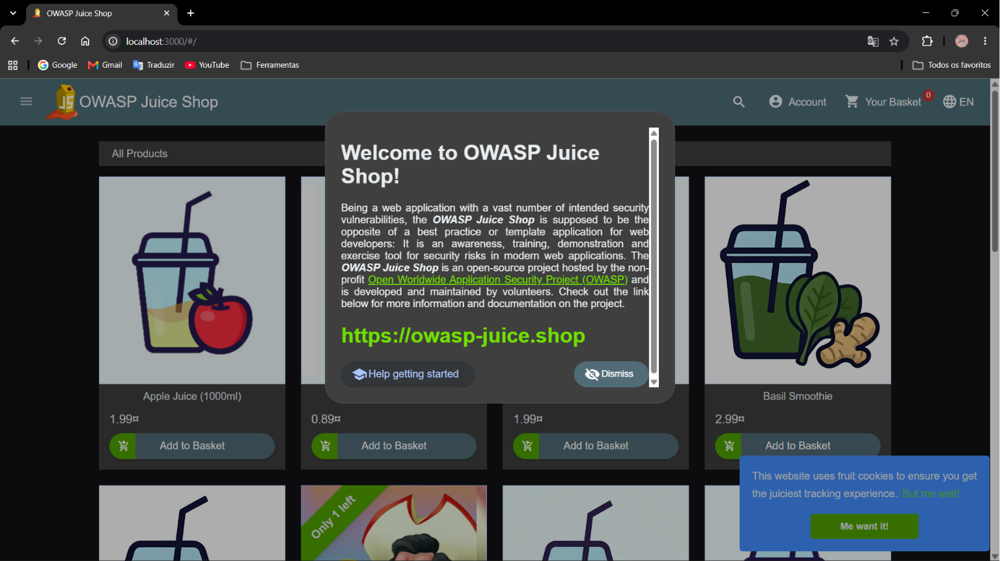
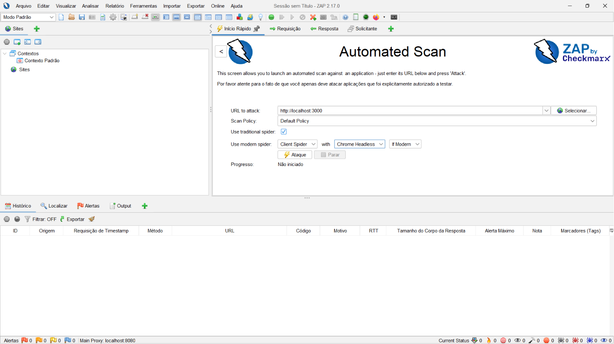
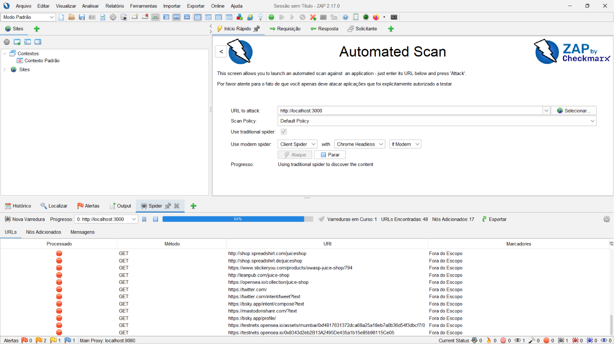
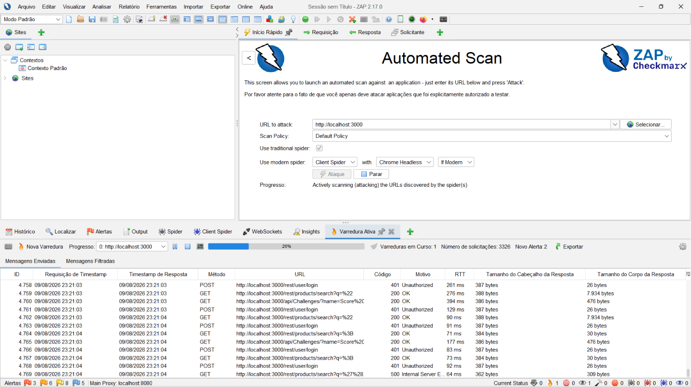
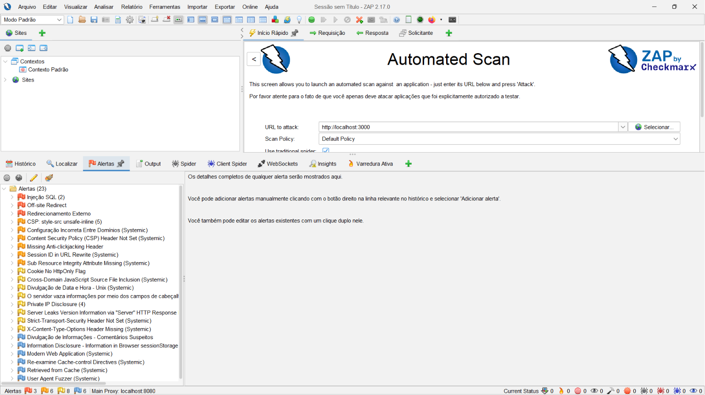
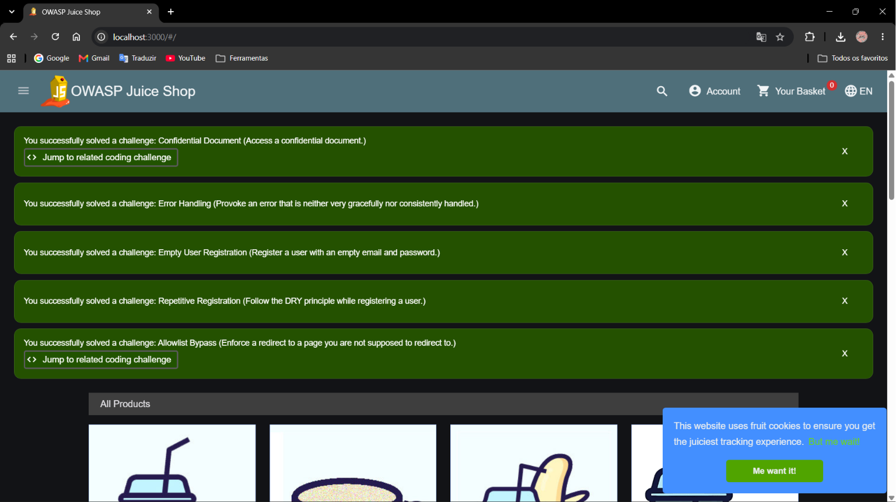

# 5 — Relatório de Verificação de Vulnerabilidades

Este documento consolida a verificação da Etapa 5. O escopo desta atividade consiste na realização de testes de segurança dinâmicos (DAST) em uma aplicação controlada, analisando possíveis falhas de segurança por meio de varreduras automatizadas, interpretando seus alertas e propondo correções.

## 5.1 Ambiente e configuração da verificação
### 5.1.1 Justificativa do Ambiente de Laboratório

A plataforma **Nexora** é um projeto de software concebido de maneira **100% fictícia e documental**, o que significa que o grupo não possui uma implementação web executável em ambiente de produção para ser testada diretamente.

Para suprir essa limitação técnica e cumprir os objetivos pedagógicos da disciplina, a equipe estabeleceu um ambiente de laboratório seguro utilizando o **OWASP Juice Shop**. O Juice Shop é uma aplicação web de código aberto e deliberadamente vulnerável, desenvolvida para fins de treinamento e educação em segurança de aplicações web.

Essa abordagem permite que o grupo execute uma sessão de varredura dinâmica real, avalie as saídas de segurança de uma ferramenta de DAST e desenvolva as análises técnicas de risco necessárias para a consolidação deste relatório.

### 5.1.2 Especificação Técnica do Ambiente de Testes

Para garantir a reprodutibilidade dos testes e a validade científica das evidências, o setup do laboratório foi configurado com os seguintes parâmetros técnicos:
| Item | Informação |
| :--- | :--- |
| Sistema Operacional da Máquina de Testes: | Windows 11 |
| Ambiente de Execução de Containers: | Docker Desktop (v4.85.0) |
| Aplicação Alvo (Testada): | OWASP Juice Shop (v20.1.1) |
| Endereço de Acesso Local: | `http://localhost:3000` |
| Porta de Comunicação: | 3000 |
| Ferramenta de Varredura Ativa (DAST): | OWASP ZAP (ZAP Version: 2.17.0) |
| Escopo do Teste: | Restrito estritamente à aplicação Juice Shop rodando localmente na porta de testes da equipe, sem interações com serviços de terceiros externos ou sistemas públicos de produção. |
| Data de Execução da Varredura: | 09 de agosto de 2026 |
| Responsável pela Execução: | Bruna Rosa Ferreira |

---

### 5.1.3 Evidências da Execução (Varredura de Segurança)

Os registros visuais a seguir comprovam a configuração do ambiente de laboratório, a execução da varredura automatizada pelo OWASP ZAP e os alertas identificados durante a sessão de testes. Todos os arquivos estão salvos na pasta de evidências do repositório.

#### 1. Aplicação-Alvo em Execução

O container Docker do OWASP Juice Shop foi iniciado e disponibilizado localmente na porta 3000.

#### 2. Configuração de Escopo e Alvo no OWASP ZAP

Configuração do OWASP ZAP apontando a varredura para a instância local do Juice Shop.

#### 3. Início da Varredura e Mapeamento da Aplicação

Registro do início da sessão de testes realizada pelo OWASP ZAP, incluindo o processo inicial de identificação e mapeamento dos recursos da aplicação.

#### 4. Varredura Dinâmica em Progresso (Active Scan)

Registro da execução do Active Scan do OWASP ZAP sobre a aplicação-alvo, durante a qual a ferramenta realizou requisições automatizadas para verificar possíveis vulnerabilidades.

#### 5. Painel Consolidado de Alertas Gerados

Painel de alertas do OWASP ZAP apresentando os achados identificados durante a sessão de verificação e suas respectivas classificações de risco.

#### 6. Efeito Visível das Requisições de Ataque no Alvo

Registro do comportamento observado na interface do OWASP Juice Shop durante a execução das requisições automatizadas realizadas pelo scanner.

> ⚠️ **Nota sobre os alertas individuais:** As capturas específicas dos três alertas selecionados serão adicionadas a esta seção após a definição dos achados que serão analisados individualmente pela equipe, sendo um alerta de responsabilidade de Gabriela e dois de responsabilidade de Erik.

## 5.2 Registro consolidado dos achados

| ID | Alerta ou achado | Evidência | Possível impacto | Relação CWE/OWASP | Correção proposta |
| :---: | :--- | :--- | :--- | :--- | :--- |
| A01 | **Pendente — Pacote B** | Pendente | Pendente | Pendente | Pendente |
| A02 | **Pendente — Pacote C, se encontrado** | Pendente | Pendente | Pendente | Pendente |
| A03 | **Pendente — Pacote C, se encontrado** | Pendente | Pendente | Pendente | Pendente |

## 5.3 Possíveis falsos positivos e alertas descartados

Esta seção deverá registrar, para cada alerta questionado ou descartado:

- identificação original da ferramenta;
- evidência analisada;
- razão técnica para confirmar, reclassificar ou descartar;
- limitação que impeça uma conclusão definitiva;
- necessidade de teste manual adicional, quando aplicável.

**Situação atual:** não existem alertas disponíveis para análise.

## 5.4 Limitações da verificação

- A Nexora não possui implementação executável versionada neste repositório.
- Nenhuma sessão de OWASP ZAP ou ferramenta equivalente foi documentada.
- Não há evidência que permita afirmar a existência ou ausência de uma
  vulnerabilidade real na Nexora.
- Resultados obtidos em aplicação educacional deliberadamente vulnerável devem
  ser apresentados como resultados daquele ambiente, e não como falhas
  comprovadas da Nexora.

## 5.5 Itens necessários para concluir o relatório

1. Especificação do ambiente autorizado e da ferramenta utilizada pelo Pacote
   A.
2. Evidências reais da execução e caminhos dos arquivos.
3. Análise técnica do Alerta 1 pelo Pacote B.
4. Análises dos Alertas 2 e 3 pelo Pacote C, caso existam.
5. Registro dos alertas descartados e da possibilidade de falsos positivos.
6. Revisão dos impactos, referências e correções antes da conclusão.

## 5.6 Considerações finais

A conclusão será redigida depois da incorporação das evidências e análises dos
Pacotes A, B e C. Até esse momento, este arquivo representa apenas a estrutura
de consolidação e não um relatório de resultados.
